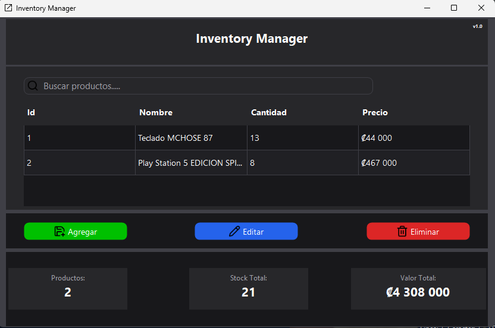

# Inventory Manager
A desktop inventory management application developed with C# and Windows Forms.
The application allows users to manage products through a simple and modern interface, storing inventory information locally using SQLite

## Features

- Add new products
- Edit existing products
- Delete products with confirmation
- Search products by name in real time
- Track available stock
- Calculate the total inventory value
- Display inventory statistics
- Input validation
- Persistent local storage with SQLite
- Modern dark interface

## Technologies
- C#
- .NET
- Windows Forms
- SQLite
- Microsoft.Data.Sqlite
- Guna UI2
- Git / Github

## Screenshots

### Main Interface



### Add product


### Edit product


### Delete product


## Project Structure

```text
SistemaDeInventarioWinForms/
├── Data/
│   └── BaseDatos.cs
├── Models/
│   └── Producto.cs
├── Services/
│   └── Inventario.cs
├── Forms/
│   ├── FormPrincipal.cs
│   ├── FormAgregarProductosModerno.cs
│   ├── FormActualizarProductosModerno.cs
│   └── FormEliminarModerno.cs
└── Program.cs
```
The project separates the application into models, data access, business logic and user interface components.

## Installation

1. Clone the repository:

```bash
git clone https://github.com/Brandonrdg/Inventory-Manager.git
```
2. Open the solution in Visual Studio.

3. Restore the NuGet packages.

4. Build and run the project.

## Database

The application uses SQLite for local data persistence.

Each product contains:

- ID
- Name
- Quantity
- Price

The application performs CRUD operations using parameterized SQL queries.

## What I Learned

This project helped me practice and improve my knowledge of:

- Object-oriented programming in C#
- Classes, objects, methods and parameters
- CRUD operations
- SQL and SQLite
- Parameterized SQL queries
- Windows Forms
- Event-driven programming
- Input validation
- DataGridView management
- UI design
- Git and version control
- Code organization and refactoring

## Version

**1.0.0**

First stable version of Inventory Manager.

## Author

**Brandon David Rodriguez Abarca**

System Engineering Student

